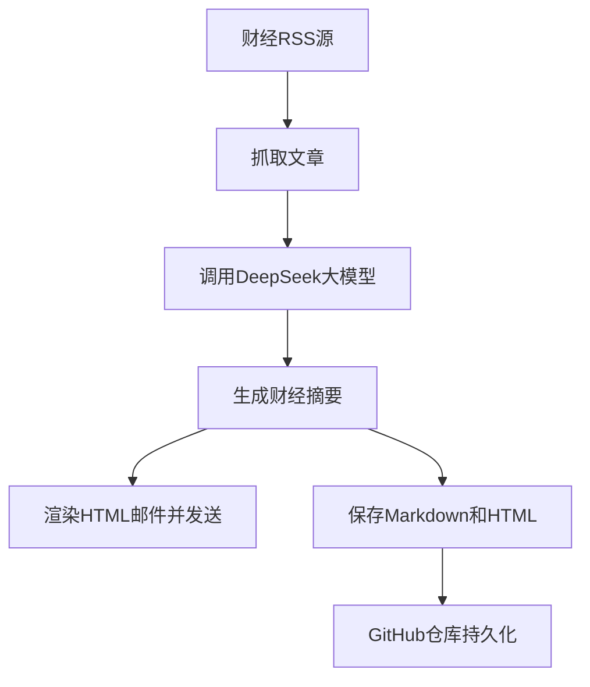

# 📈 FinNewsCollectionBot · 每日财经速递

**为专业投资者打造的智能财经资讯助手**

[](https://github.com/sgrsun3/FinNewsCollectionBot/actions/workflows/rss-bot.yml)


---
## 🧧 支持作者 · 让项目持续进化！

如果本项目对你有帮助，欢迎打赏支持，资助我多喝几杯咖啡 ☕，跑更多模型 💻～

<div align="center">
  
</div>

- 💬 微信号：`ArkhamKni9ht`
- 🙌 感谢每一位 Star、Fork 和支持者！

> ✨ 金融爸爸一块钱我不嫌少，一百块我也不嫌多 😊
---

## 🎯 项目简介

FinNewsCollectionBot 是一款为券商分析师、基金经理、研究员等专业投资人量身打造的**财经资讯智能摘要助手**。

它自动聚合主流财经媒体的 RSS 信息源，并调用 **DeepSeek 大语言模型**，每天两次推送核心财经摘要，帮助你快速掌握全球市场动态、产业趋势与政策走向。

---

## 🚀 核心功能

- ⏰ **每日两次自动摘要推送**  
  每天上午 09:00、下午 17:00 定时运行，生成分析报告

- 🌐 **多源财经 RSS 聚合**  
  支持华尔街见闻、36氪、东方财富、华尔街日报、BBC 等主流财经媒体

- 🧠 **大模型深度分析**  
  使用 DeepSeek 大语言模型自动提炼财经新闻的核心内容与趋势判断

- 📧 **HTML 邮件推送**
  通过 SMTP 将完整报告作为 HTML 邮件正文发送，无需打开第三方详情页

- 🗂️ **双格式持久化**
  每次运行同时保存 Markdown 和 HTML，并由 GitHub Actions 自动提交到仓库

---

## 🧑‍💻 技术栈

- Python
- feedparser + newspaper3k
- Markdown + HTML 邮件
- DeepSeek 大语言模型 API
- GitHub Actions 自动定时部署

---

## 🔧 快速开始（GitHub Actions）

1. Fork 本项目后，打开 `Settings → Secrets and variables → Actions`。
2. 在 `Repository secrets` 中添加以下必填变量：

   | Secret | 说明 |
   | --- | --- |
   | `OPENAI_API_KEY` | DeepSeek API Key |
   | `SMTP_HOST` | SMTP 服务器，如 `smtp.qq.com` |
   | `SMTP_USERNAME` | 发件邮箱账号 |
   | `SMTP_PASSWORD` | 邮箱授权码或应用专用密码，不是普通登录密码 |
   | `MAIL_TO` | 收件邮箱，多个地址用英文逗号分隔 |

3. 需要时可添加以下可选变量：

   | Secret | 默认值 | 说明 |
   | --- | --- | --- |
   | `SMTP_PORT` | `465` | SMTP 端口 |
   | `SMTP_SECURITY` | `ssl` | 支持 `ssl` 或 `starttls` |
   | `MAIL_FROM` | `SMTP_USERNAME` | 邮件的发件人地址 |

4. 打开 `Settings → Actions → General → Workflow permissions`，确保允许 Actions 写入仓库。
5. 进入 `Actions → RSS 财经新闻邮件推送 → Run workflow` 手动测试一次。

常见邮箱配置：

| 邮箱 | `SMTP_HOST` | `SMTP_PORT` | `SMTP_SECURITY` |
| --- | --- | --- | --- |
| QQ 邮箱 | `smtp.qq.com` | `465` | `ssl` |
| 163 邮箱 | `smtp.163.com` | `465` | `ssl` |
| Gmail | `smtp.gmail.com` | `465` | `ssl` |
| Outlook.com | `smtp-mail.outlook.com` | `587` | `starttls` |
| Microsoft 365 | `smtp.office365.com` | `587` | `starttls` |

QQ 和 163 邮箱需要在邮箱设置中开启 SMTP 并生成授权码；Gmail 需要应用专用密码。请勿将密钥或授权码直接写入代码。

成功部署后，工作流会在北京时间每天 09:00 和 17:00 运行。GitHub Actions 定时任务可能存在数分钟延迟。

## 🗂️ 报告归档

每次成功生成摘要后，报告会保存为：

```text
reports/
└── 2026/
    └── 09/
        ├── 2026-09-02-090000.md
        └── 2026-09-02-090000.html
```

HTML 文件与邮件正文内容一致，Markdown 文件保留便于搜索和二次处理的原始格式。

> 注意：公开 fork 中的 `reports/` 文件任何人都能查看。GitHub 不支持将公开仓库的 fork 直接改为私有；如果报告不应公开，请将项目复制到独立的私有仓库。

---

## 💼 使用场景

- 券商/基金公司/研究所自动生成投资快报
- 金融从业者日常资讯监测
- 个人投资者快捷了解宏观政策/产业热点
- 财经内容运营/财经公众号 AI 辅助创作

---

## 📌 示例流程图



---

## 🛠️ 后续规划

- ✅ 增加更多 RSS 财经数据源
- ✅ 引入情绪分析与金融事件检测
- ⏳ 支持多语言财经摘要生成
- ⏳ 构建简洁前端页面用于非技术用户管理配置

---

## 🤝 欢迎参与

📬 欢迎 Star ⭐ / Fork 🍴 / PR 💡 本项目，一起共建更智能的财经决策工具。

你也可以通过 Issues 留言建议功能，或私信我交流使用体验～

---

© 2024 sgrsun3 | MIT License
